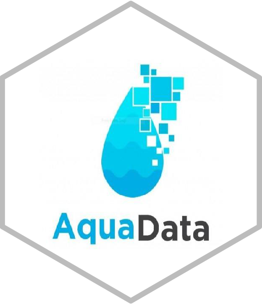

<!-- README.md is generated from README.Rmd. Please edit that file -->

# aquadata.data.mapping

<!-- badges: start -->

[](https://zenodo.org/badge/latestdoi/584795495)

<!-- badges: end -->



The goal of **aquadata.data.mapping** is to collect metadata within the
context aquatic food systems in order to identify data gaps and generate
new data in key geographic region: Bangladesh, Cambodia, Ghana, India,
Myanmar, Nigeria, Solomon Islands, Timor-Leste and Zambia.

**aquadata.data.mapping** uses metadata information to download data and
elaborate data stories and scientific reports’ summaries using AI tools
(ChatGPT).

This repository is part of work package 1 “***AquaData***” of the
initiative “***Resilient Aquatic Food Systems for Healthy People and
Planet***” (<https://cgspace.cgiar.org/handle/10568/121141> ).

Further info:

<https://www.cgiar.org/initiative/15-resilient-aquatic-foods-for-healthy-people-and-planet/>

## To get started

Install and load the R package from the most recent version using the
following commands on the R console:

``` r
#install.packages("devtools")
#devtools::install_github("WorldFishCenter/aquadata.data.mapping")
library(aquadata.data.mapping)
```

## Explore the data

Once installed, you can access and explore the data directly from the
package. `dataverse_metadata` include metadata information on the data
of several CGIAR organizations, while `worldfish_guestbook_responses`
include information provided by the users downloading WorldFish data.

``` r
# Summary of dataverse_metadata 
dplyr::glimpse(dataverse_metadata)
#> Rows: 22,181
#> Columns: 9
#> $ organization           <chr> "AllianceBioversityCIAT", "AllianceBioversityCI…
#> $ dataset_id             <int> 3248318, 3248318, 3248318, 3248318, 3248318, 32…
#> $ dataset_doi            <chr> "doi:10.7910/DVN/DAYUIL", "doi:10.7910/DVN/DAYU…
#> $ publication_date       <date> 2021-03-11, 2021-03-11, 2021-03-11, 2021-03-11…
#> $ title                  <chr> "environmental awareness and attitudes among st…
#> $ subject                <chr> "Agricultural Sciences", "Agricultural Sciences…
#> $ keyword_value          <chr> "climate change", "climate change adaptation", …
#> $ keyword_vocabulary     <chr> "AGROVOC", "AGROVOC", "AGROVOC", NA, "AGROVOC",…
#> $ keyword_vocabulary_uri <chr> "http://aims.fao.org/aos/agrovoc/c_1666", "http…

# CGIAR organizations
unique(dataverse_metadata$organization)
#> [1] "AllianceBioversityCIAT" "ASTI"                   "CCAFSbaseline"         
#> [4] "CIAT"                   "IFPRI"                  "RiceResearch"          
#> [7] "worldfish"

# Summary of worldfish_guestbook_responses 
dplyr::glimpse(worldfish_guestbook_responses)
#> Rows: 8,529
#> Columns: 16
#> $ guestbook        <chr> "WorldFish Guestbook", "WorldFish Guestbook", "WorldF…
#> $ title            <chr> "myanmar baseline aquaculture performance assessment"…
#> $ dataset_doi      <chr> "doi:10.7910/DVN/MIYZYQ", "doi:10.7910/DVN/MIYZYQ", "…
#> $ publication_date <date> 2022-12-26, 2022-12-26, 2022-12-26, 2022-12-26, 2022…
#> $ type             <chr> "Download", "Download", "Download", "Download", "Down…
#> $ file_name        <chr> "20190719 G01_food_certification.tab", "20190719 D07_…
#> $ file_id          <int> 3677836, 3677828, 3677827, 3677821, 3677819, 3677851,…
#> $ file_doi         <chr> "doi:10.7910/DVN/MIYZYQ/UW6ZPH", "doi:10.7910/DVN/MIY…
#> $ user_name        <chr> "fda08cf2", "fda08cf2", "fda08cf2", "fda08cf2", "fda0…
#> $ email            <chr> "b9cb1ce6", "b9cb1ce6", "b9cb1ce6", "b9cb1ce6", "b9cb…
#> $ institution      <chr> "gw", "gw", "gw", "gw", "gw", "gw", "gw", "gw", "gw",…
#> $ position         <chr> NA, NA, NA, NA, NA, NA, NA, NA, NA, NA, NA, NA, NA, N…
#> $ question_1       <chr> "Briefly describe how the data will be used", "Briefl…
#> $ answer_1         <chr> "research", "research", "research", "research", "rese…
#> $ question_2       <chr> "Where are you located?", "Where are you located?", "…
#> $ answer_2         <chr> "nc", "nc", "nc", "nc", "nc", "nc", "nc", "nc", "nc",…
```

You can filter the data using the `filterby_word` function and show the
first 10 rows:

``` r
filtered_metadata <- filterby_word(word = "Bangladesh")
head(filtered_metadata)
#> # A tibble: 6 × 9
#>   organization datase…¹ datas…² publicat…³ title subject keywo…⁴ keywo…⁵ keywo…⁶
#>   <chr>           <int> <chr>   <date>     <chr> <chr>   <chr>   <chr>   <chr>  
#> 1 ASTI          2693658 doi:10… 2015-11-03 asti… Arts a… bangla… AGROVOC http:/…
#> 2 ASTI          2693658 doi:10… 2015-11-03 asti… Arts a… south … AGROVOC http:/…
#> 3 ASTI          2693658 doi:10… 2015-11-03 asti… Arts a… asia    AGROVOC http:/…
#> 4 ASTI          2693658 doi:10… 2015-11-03 asti… Arts a… agricu… AGROVOC http:/…
#> 5 ASTI          2693658 doi:10… 2015-11-03 asti… Social… bangla… AGROVOC http:/…
#> 6 ASTI          2693658 doi:10… 2015-11-03 asti… Social… south … AGROVOC http:/…
#> # … with abbreviated variable names ¹​dataset_id, ²​dataset_doi,
#> #   ³​publication_date, ⁴​keyword_value, ⁵​keyword_vocabulary,
#> #   ⁶​keyword_vocabulary_uri
```

## Download Data

Use `get_dataset` and `get_dataset_file` to download data.

## Generate stories using AI

Use AI tools (ChatGPT) to generate stories from downloaded data.

``` r
#output <-
#  summarise_chatgpt_wrapper(
#    document_path = "inst/docs_dataverse/5636634.txt",
#    openaikey = OPENAI_TOKEN,
#    engine = "gpt-3.5-turbo",
#    temperature = 0.7,
#    refine_text = REFINE_TEXT
#  )
#cat(output$output_text)
```
